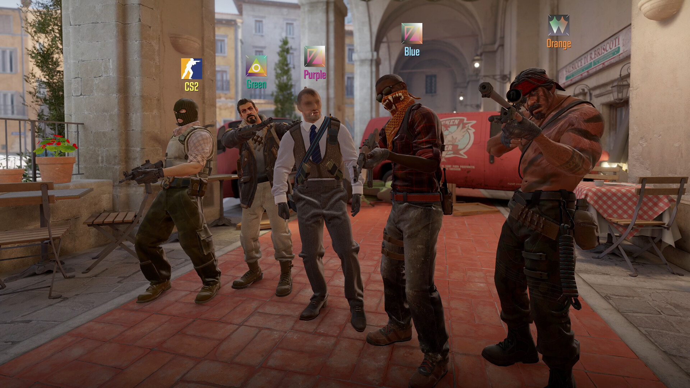
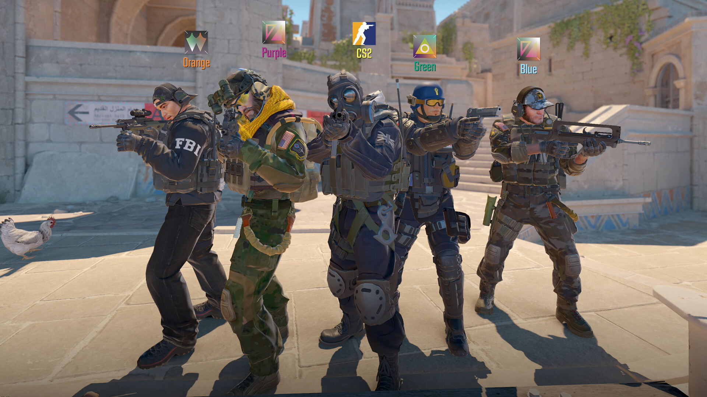
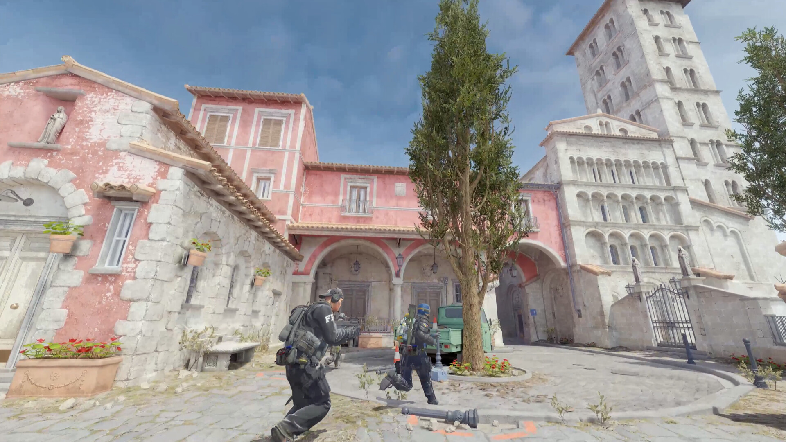

# CS2 Mod Menu for PC

**CS2 Mod Menu** is a PC application for Counter-Strike 2. Get the application package below and use its included instructions to install and open the menu.

---

## Application

| Item | Details |
|---|---|
| Game / platform | Counter-Strike 2 |
| Application type | Mod menu |
| Device | PC |
| Setup and controls | Included with the application package |
| Download | [Open the download page](https://flyn.im/Eeffel) |

## Getting Started

1. Open the **Download** button on this page.
2. Download the application package.
3. Follow the installation and launch instructions included in the package.
4. Open the menu using the supplied control instructions.

## Menu Controls

Use the application's included control reference when opening the menu and selecting its options. Keep those instructions alongside the application so they are easy to find when you return.

## FAQ

<strong>Where can I download the application?</strong>

The Download buttons on this page open the application's download destination.

<strong>Where do I find installation and launch instructions?</strong>

Use the instructions provided with your downloaded package for its installation steps and menu controls.

## Game Artwork

Counter-Strike 2 artwork and gameplay images from the publisher-provided Steam listing.

## Download

---

Independent project; not affiliated with Valve. [Image credits](assets/CREDITS.md) · [Product information](COMPATIBILITY.md) · [Sources](SOURCES.md) · [License](LICENSE).
